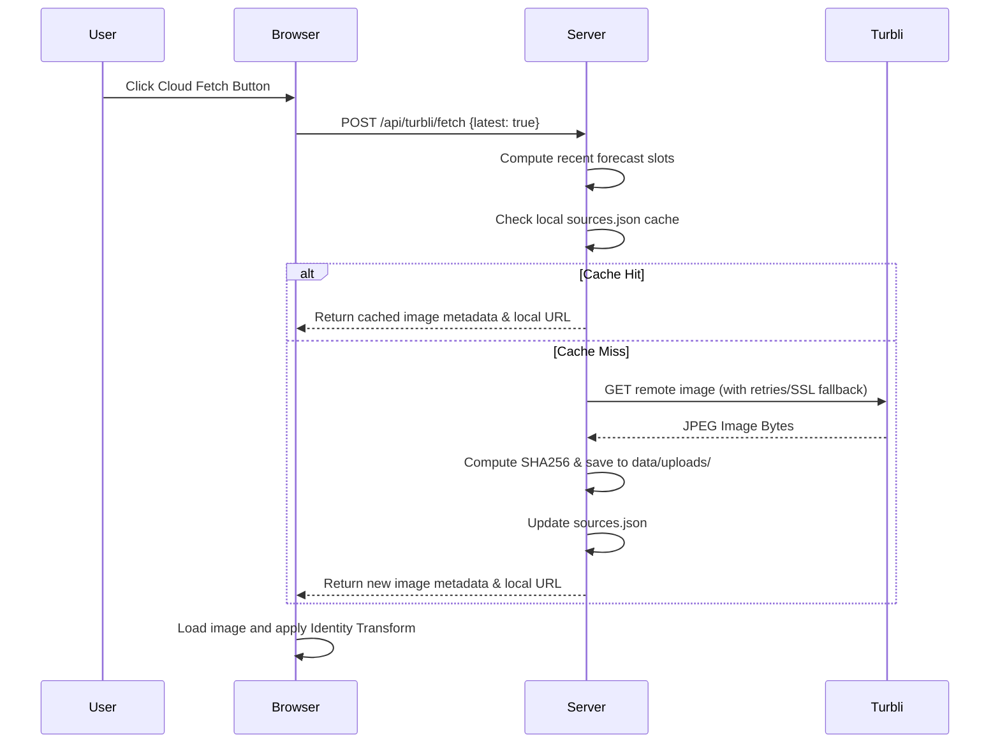

# Turbli GPS

A dependency-light local web app for aligning Turbli turbulence forecast images over a GPS-aware US state map.

## Features

- Browser GPS watch with copyable latitude/longitude, altitude, and accuracy display.
- US state outline map using Web Mercator.
- Turbli image overlay with drag, scale, rotation, paste, drop, and file upload support.
- One-click cloud fetch for the latest available Turbli US CAT map at 33,000 ft.
- Local source and alignment persistence by image hash, source, and source family.
- No external Python packages required for the core server or browser client.

## Architecture

The application is split between a lightweight Python HTTP server backend and a Vanilla JS/CSS frontend. The backend handles local storage of images and transform matrices, as well as proxying fetch requests to Turbli.com. The frontend handles rendering the SVG map, overlaying the image, touch/mouse gesture transformations, and browser geolocation.

```mermaid
graph TD
    subgraph Frontend [Browser]
        UI[Vanilla HTML/CSS/JS]
        Map[SVG Map Rendering]
        Gestures[Touch/Mouse Gestures]
        GPS[Browser Geolocation API]
        UI <--> Map
        UI <--> Gestures
        UI <--> GPS
    end

    subgraph Backend [Python 3 Server]
        HTTP[http.server.ThreadingHTTPServer]
        App[TurbliApp Core Logic]
        Storage[JSON File Storage]
        HTTP <--> App
        App <--> Storage
    end

    subgraph External [External Services]
        Turbli[Turbli.com (Images)]
    end

    UI <-->|JSON API / Static Files| HTTP
    App <-->|HTTPS GET| Turbli
```

### Data Flow: Fetching Turbli Image



## Installation

The core application has **no external dependencies** beyond Python 3 standard library.
However, to run the test suite with coverage, you need `pytest` and `pytest-cov`.

```bash
# Optional: Create a virtual environment for tests
python3 -m venv venv
source venv/bin/activate

# Install test dependencies (only needed for testing)
pip install pytest pytest-cov
```

## Run

You can run the server directly using Python or via the provided shell script.

```bash
# Using the helper script (default: 127.0.0.1:8765)
./run.sh

# Or directly with Python
python3 server.py --host 127.0.0.1 --port 8765
```

Open `http://127.0.0.1:8765` in your browser.

## Controls

- **Cloud:** fetches the latest available Turbli US CAT forecast at 33,000 ft.
- **Compass:** starts or stops browser GPS tracking.
- **Reset:** returns the map view to its default position.
- **Image:** toggles between aligning the image and moving the canvas.
- **Clipboard:** opens image upload; pasted or dropped images also work.
- **Hamburger:** expands or collapses the control pane.

## Data

Runtime data is written under `data/` and is intentionally ignored by git:

- `data/uploads/` stores uploaded or fetched images.
- `data/sources.json` tracks available image sources.
- `data/transforms.json` stores overlay alignments.

The app does not need secrets or API keys. Browser geolocation is handled locally and is not sent to any third-party service by this app.

## Tests

The project includes a robust test suite covering both business logic and HTTP routing.

```bash
# Run tests with coverage
python3 -m pytest --cov=turbli_gps --cov-report=term-missing tests/

# Check JS syntax
node --check static/app.js
```
